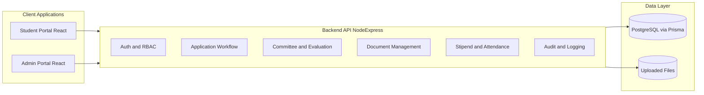
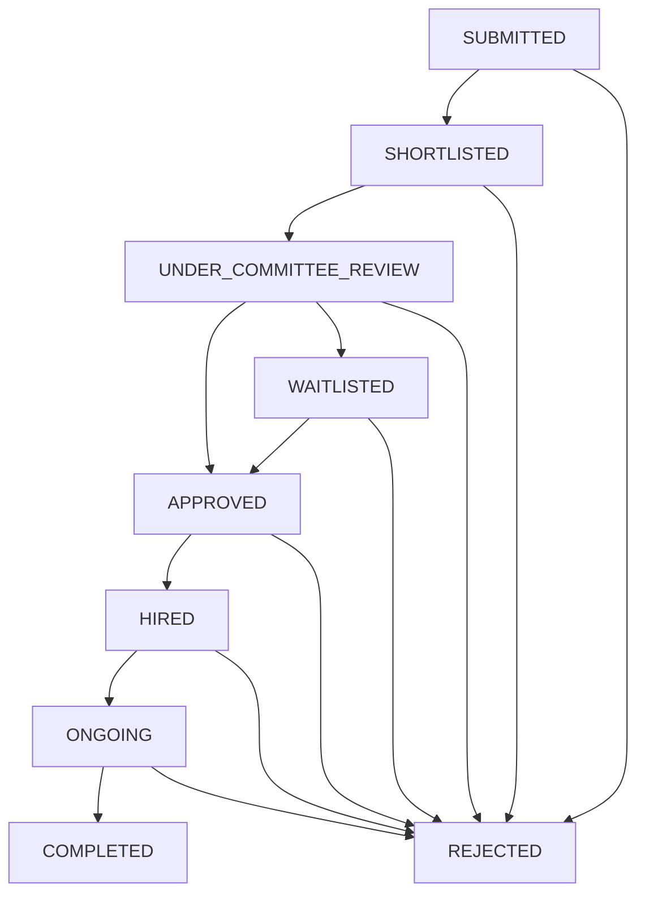
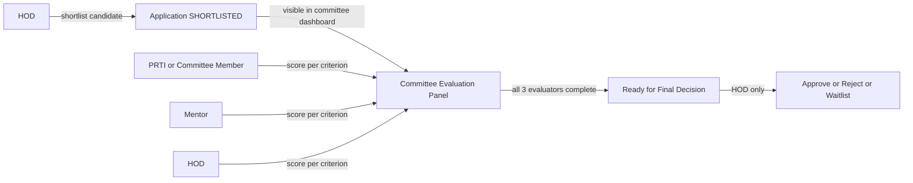
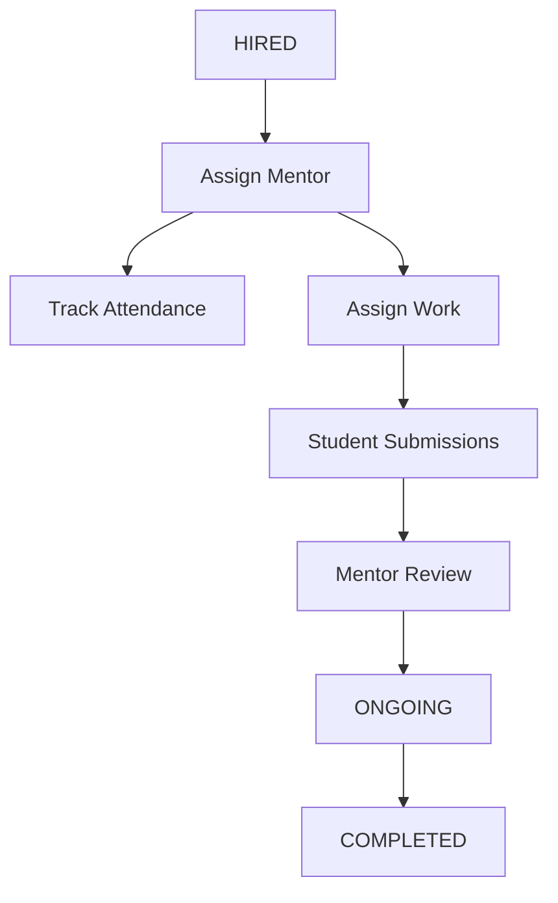
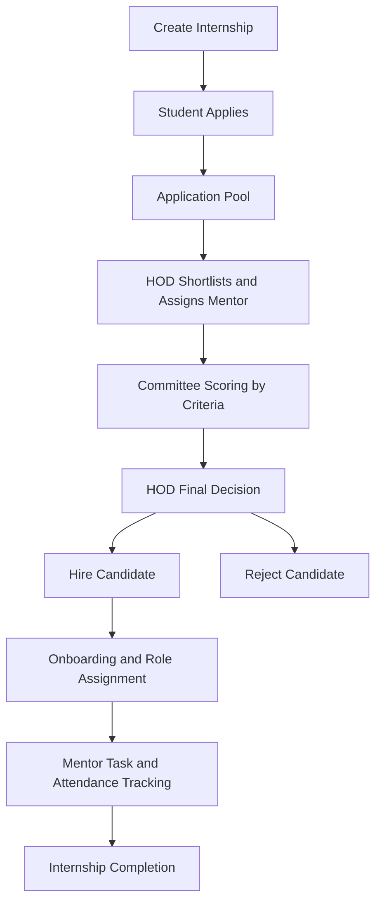
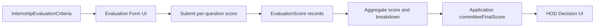
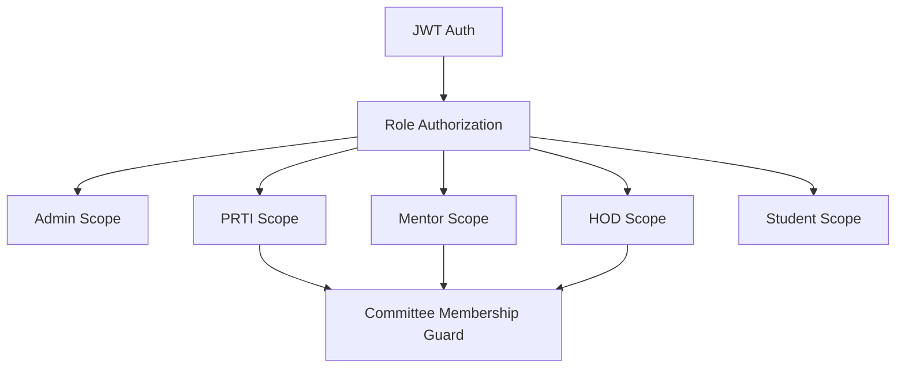

# APTRANSCO Internship Portal

Comprehensive technical documentation for the APTRANSCO Internship Portal ecosystem.

## 1) Project Overview

The APTRANSCO Internship Portal is a multi-role recruitment and internship management platform with:

- A **student portal** for profile creation, internship discovery, and applications.
- An **admin operations portal** for Admin, CE/PRTI, HOD, Mentor, and committee workflows.
- A **backend API** that handles authentication, workflows, scoring, shortlisting, document handling, stipend, attendance, and audit trails.

Primary objective:
- Digitize the internship lifecycle from application intake to final hiring and internship tracking.

---

## 2) High-Level System Architecture



---

## 3) Technology Stack

## Backend
- **Runtime**: Node.js
- **Framework**: Express.js
- **ORM**: Prisma
- **Database**: PostgreSQL
- **Authentication**: JWT-based auth middleware
- **Security**: Helmet, rate limiting, request sanitization, file validation hooks
- **File processing**: Multer, file-type, optional ClamAV integration

## Frontend
- **Framework**: React
- **Build tool**: Vite
- **Routing**: React Router
- **HTTP client**: Axios
- **UI**: TailwindCSS + custom design system components
- **Icons/Charts**: Lucide, Recharts

## Project/Tooling
- npm workspaces-like structure (root + app-level packages)
- ESLint in web apps
- Environment files per app (`.env` + `.env.example`)

---

## 4) Repository Structure

```text
internship portal/
  backend/               # API server, Prisma schema, controllers, services
  frontend/              # Student-facing React app
  admin-portal/          # Admin/HOD/PRTI/Mentor React app
  doc_templates/         # Additional templates/resources
  email_service/         # Email templates
  PROJECT_DOCUMENTATION.md
```

---

## 5) Roles and Authorization Model

Supported roles (from backend enum):

- `STUDENT`
- `HOD`
- `COMMITTEE_MEMBER`
- `MENTOR`
- `CE_PRTI`
- `ADMIN`

Authorization principles:
- All protected routes require authenticated JWT.
- Role-gated routes apply `authorize(...)` middleware.
- Committee evaluation additionally verifies **committee membership or allowed committee roles**.

---

## 6) Core Business Workflow

## 6.1 Application Lifecycle



## 6.2 Shortlisting and Evaluation Flow



## 6.3 Internship Execution Flow



---

## 7) Data Model Summary (Prisma)

Key entities:

- `User` (role, department, credentials)
- `StudentProfile`
- `Internship` (roles, documents, preferred colleges, evaluation criteria)
- `Application` (status, assigned role, mentor, score fields)
- `Committee` (hodId, mentorId, prtiMemberId, interview metadata)
- `InternshipEvaluationCriteria` (question, maxScore)
- `EvaluationScore` (applicationId, memberId, role, questionId, score)
- `Document` (application documents)
- `Stipend`, `Attendance`, `WorkAssignment`, `WorkSubmission`
- `AuditLog`

Relationship highlights:
- One internship has many applications.
- One application belongs to one student profile and one internship.
- Committee scoring is per application and per criterion.

---

## 8) Backend Modules (Functional Breakdown)

## 8.1 Authentication
- Registration/login for users.
- JWT token issuance and protected route enforcement.
- Role-based authorization on routes.

## 8.2 Internship and Applications
- Create, list, update, toggle internships.
- Student applies to internships.
- Admin/HOD review application pools.
- Status transition orchestration via workflow service.

## 8.3 Committee and Evaluation
- Committee app listing.
- Per-question scoring endpoint.
- Final approval workflow.
- Evaluation completion checks by required committee roles.

## 8.4 Mentor Operations
- Mentor intern listing.
- Work assignment creation and tracking.
- Submission review.
- Attendance marking and retrieval.

## 8.5 Platform Configuration and Audit
- Portal/document configuration endpoints.
- Audit log creation for sensitive operations.
- Health and diagnostics endpoints.

---

## 9) Frontend Applications

## 9.1 Student Portal

Capabilities:
- Authentication and profile setup.
- Internship browse/apply.
- Application status tracking.
- Attendance and task/submission views (where enabled).

## 9.2 Admin Portal

Role-specific experiences:
- **ADMIN**: platform-wide configuration and oversight.
- **CE/PRTI**: committee supervision and reporting.
- **HOD**: shortlisting, mentor assignment, final selection authority.
- **MENTOR**: committee scoring, intern management, attendance/task workflows.

Shared UI concepts:
- Protected role-based routes.
- Rich application profile modal.
- Dashboard cards, filters, groupings, and actionable tables.

---

## 10) Key API Domains

Primary route groups:

- `/api/v1/auth/*`
- `/api/v1/admin/*`
- `/api/v1/student/*`
- `/api/v1/prti/*`
- `/api/v1/mentor/*`

Common design patterns:
- JSON response envelope `{ success, data, message }`
- Role-protected route groups
- Prisma includes/select for joined data

---

## 11) Security and Compliance Notes

Implemented controls:
- JWT authentication middleware
- Role-based route authorization
- Rate limiting
- Helmet middleware stack (available/configured in project)
- File upload validation (MIME/signature)
- Audit logging for critical actions

Recommended production hardening:
- Strict CORS allowlist from environment
- Token lifecycle hardening (short-lived access + refresh strategy)
- Centralized structured logging and alerting
- CI security scanning and dependency audit policy

---

## 12) Operational and Deployment Considerations

Environment management:
- Separate env files for backend and both frontend apps
- Ensure production secrets are injected via secure secret management

Suggested runtime topology:
- Backend API behind reverse proxy
- PostgreSQL managed service or hardened dedicated instance
- Static frontend hosting (CDN-backed) for both web apps

Observability baseline:
- Request/response logging with request IDs
- Error-rate and latency dashboards
- Health endpoint monitoring with alerts

---

## 13) Current Strengths

- Clear domain modeling with Prisma.
- Rich role-driven workflow coverage.
- Good feature breadth: shortlisting, committee scoring, mentor operations.
- Practical UI tooling and fast iteration stack (React + Vite).

---

## 14) Improvement Roadmap (Executive Summary)

## Immediate (0-2 weeks)
- Enforce auth/authorization consistency across all sensitive routes.
- Unify status vocabularies across backend and UIs.
- Remove legacy duplicated workflow paths.

## Short-term (2-6 weeks)
- Add CI gates (lint/build/tests).
- Add backend integration tests for critical workflow invariants.
- Centralize API error handling + frontend toast/error UX.

## Medium-term (6-12 weeks)
- Consolidate duplicated evaluation models into one canonical scoring model.
- Decompose oversized controllers/pages into domain modules/hooks.
- Add structured observability and release discipline.

---

## 15) Detailed Process Graphs

## 15.1 End-to-End Recruitment Graph



## 15.2 Scoring Data Flow



## 15.3 Access Control Graph



---

## 16) Suggested Documentation Extensions

For enterprise-grade documentation completeness, add:
- OpenAPI spec with endpoint contracts.
- ERD generated from Prisma schema.
- Sequence diagrams for critical use-cases.
- Runbook for incidents and rollback.
- Release checklist and change-management policy.

---

## 17) Maintainer Notes

- Keep enums synchronized across backend and both frontend apps.
- Avoid adding direct status writes outside workflow service.
- Prefer centralized utilities for fuzzy college matching and role policy.
- Add tests whenever touching application state transitions or auth rules.

---

## 18) Glossary

- **HOD**: Head of Department, shortlisting and final selection authority.
- **CE/PRTI**: Committee role participating in evaluation and governance.
- **Shortlist**: Candidate promoted from submission pool to committee review.
- **Committee Review**: Multi-member per-criterion scoring stage.
- **Hired/Ongoing/Completed**: Internship execution lifecycle states.

