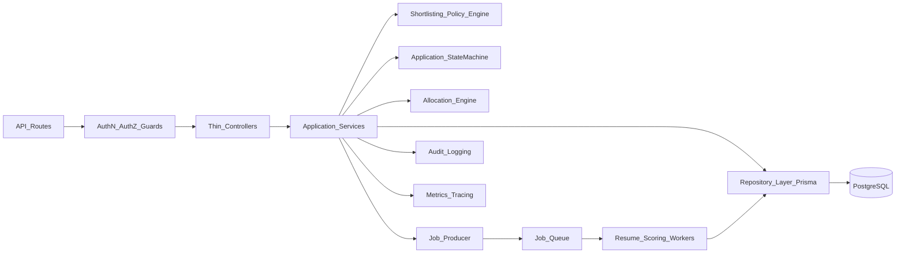

# APTRANSCO Portal Stabilization Plan

## Objectives
- Eliminate security and integrity blockers that can compromise production.
- Make shortlisting/allocation deterministic, fair, and policy-correct.
- Support 1000+ concurrent users through async processing and DB-efficient queries.
- Remove key design flaws with a domain-service + workflow-centered architecture.
- Execute with zero downtime using backward-compatible migrations and feature flags.

## Target Architecture (Moderate Re-Architecture)

## Phase 0: Safety Rails and Rollout Controls
- Add feature flags for all high-risk rewrites:
  - `FF_SECURE_ADMIN_REGISTER`
  - `FF_SHORTLIST_V2`
  - `FF_ALLOCATION_V2`
  - `FF_WORKFLOW_GUARDS`
  - `FF_PRIVATE_UPLOAD_ACCESS`
- Create migration policy:
  - Expand/contract DB migration pattern only.
  - No destructive schema changes until all code paths migrated.
- Add API versioned behavior toggles where needed to preserve clients.

Primary files:
- [C:/Users/mukka/Desktop/internship portal/backend/server.js](C:/Users/mukka/Desktop/internship portal/backend/server.js)
- [C:/Users/mukka/Desktop/internship portal/backend/prisma/schema.prisma](C:/Users/mukka/Desktop/internship portal/backend/prisma/schema.prisma)

## Phase 1: P0 Security and Access Control Fixes
1. Lock privileged account creation
- Protect `POST /auth/admin/register` with `protect + authorize('ADMIN')` or disable endpoint entirely in production.
- Introduce bootstrap admin creation through seed/migration script only.

Files:
- [C:/Users/mukka/Desktop/internship portal/backend/routes/authRoutes.js](C:/Users/mukka/Desktop/internship portal/backend/routes/authRoutes.js)
- [C:/Users/mukka/Desktop/internship portal/backend/controllers/authController.js](C:/Users/mukka/Desktop/internship portal/backend/controllers/authController.js)

2. Remove public PII leakage
- Replace `public/track` response with redacted fields.
- Require OTP-bound session token scoped to `trackingId` before detailed view.

Files:
- [C:/Users/mukka/Desktop/internship portal/backend/controllers/publicController.js](C:/Users/mukka/Desktop/internship portal/backend/controllers/publicController.js)
- [C:/Users/mukka/Desktop/internship portal/backend/routes/publicRoutes.js](C:/Users/mukka/Desktop/internship portal/backend/routes/publicRoutes.js)

3. Harden OTP flow
- Bind OTP to a destination fingerprint + nonce.
- Add strict limiter for generate/verify endpoints.
- Add attempt counter + lockout + audit trail.

Files:
- [C:/Users/mukka/Desktop/internship portal/backend/controllers/publicController.js](C:/Users/mukka/Desktop/internship portal/backend/controllers/publicController.js)
- [C:/Users/mukka/Desktop/internship portal/backend/middleware/rateLimiter.js](C:/Users/mukka/Desktop/internship portal/backend/middleware/rateLimiter.js)
- [C:/Users/mukka/Desktop/internship portal/backend/utils/otp.js](C:/Users/mukka/Desktop/internship portal/backend/utils/otp.js)

4. Secure document access
- Stop direct public static serving of uploads.
- Add authenticated document download endpoint with ownership/role checks and signed URL fallback.

Files:
- [C:/Users/mukka/Desktop/internship portal/backend/server.js](C:/Users/mukka/Desktop/internship portal/backend/server.js)
- [C:/Users/mukka/Desktop/internship portal/backend/routes/studentRoutes.js](C:/Users/mukka/Desktop/internship portal/backend/routes/studentRoutes.js)
- [C:/Users/mukka/Desktop/internship portal/backend/controllers/studentController.js](C:/Users/mukka/Desktop/internship portal/backend/controllers/studentController.js)

5. Fix IDOR and scope enforcement
- Add resource-level authorization in admin/attendance/stipend/committee endpoints.
- Enforce department and mentor ownership in controller guard utilities.

Files:
- [C:/Users/mukka/Desktop/internship portal/backend/controllers/adminController.js](C:/Users/mukka/Desktop/internship portal/backend/controllers/adminController.js)
- [C:/Users/mukka/Desktop/internship portal/backend/controllers/attendanceController.js](C:/Users/mukka/Desktop/internship portal/backend/controllers/attendanceController.js)

## Phase 2: Data Contract and Workflow Integrity
1. Resolve schema-controller mismatches
- Align `Shortlist` scoring fields and committee references with code.
- Standardize application statuses; remove invalid `PENDING` usage or add explicit enum transition mapping.
- Fix `collegeCategory` accepted values to schema-safe enum conversion.

Files:
- [C:/Users/mukka/Desktop/internship portal/backend/prisma/schema.prisma](C:/Users/mukka/Desktop/internship portal/backend/prisma/schema.prisma)
- [C:/Users/mukka/Desktop/internship portal/backend/controllers/prtiController.js](C:/Users/mukka/Desktop/internship portal/backend/controllers/prtiController.js)
- [C:/Users/mukka/Desktop/internship portal/backend/controllers/publicController.js](C:/Users/mukka/Desktop/internship portal/backend/controllers/publicController.js)
- [C:/Users/mukka/Desktop/internship portal/backend/controllers/studentController.js](C:/Users/mukka/Desktop/internship portal/backend/controllers/studentController.js)

2. Introduce centralized workflow state machine
- Create a single transition policy module (allowed transitions by role and current state).
- Replace scattered status updates with `transitionApplicationStatus(...)` service.

New files:
- `backend/domain/workflow/applicationStateMachine.js`
- `backend/services/applicationWorkflowService.js`

3. Enforce atomic seat checks and status transitions
- Wrap count + update sequences in transactions.
- Use row-level lock or optimistic locking to prevent over-allocation.

Files:
- [C:/Users/mukka/Desktop/internship portal/backend/controllers/adminController.js](C:/Users/mukka/Desktop/internship portal/backend/controllers/adminController.js)
- [C:/Users/mukka/Desktop/internship portal/backend/controllers/prtiController.js](C:/Users/mukka/Desktop/internship portal/backend/controllers/prtiController.js)

4. Fix duplicate application constraints
- Move uniqueness to deterministic rule:
  - Option A: unique `(studentId, internshipId)`.
  - Option B: enforce non-null `assignedRole` + unique `(studentId, internshipId, assignedRole)` with role requirement.
- Add idempotent create logic around application submission.

Files:
- [C:/Users/mukka/Desktop/internship portal/backend/prisma/schema.prisma](C:/Users/mukka/Desktop/internship portal/backend/prisma/schema.prisma)
- [C:/Users/mukka/Desktop/internship portal/backend/controllers/publicController.js](C:/Users/mukka/Desktop/internship portal/backend/controllers/publicController.js)

## Phase 3: Automation Correctness and Fairness (Core)
1. Build policy-driven scoring engine v2
- Replace substring `includes` with tokenization + boundary matching + normalization dictionary.
- Remove noisy requirement tokens and empty-denominator distortions.
- Add deterministic tie-breakers: score, required-skill-match, CGPA, createdAt, id.
- Replace year-of-study proxy with explicit, auditable features (or reduce weight and disclose policy).

Files:
- [C:/Users/mukka/Desktop/internship portal/backend/services/shortlistingService.js](C:/Users/mukka/Desktop/internship portal/backend/services/shortlistingService.js)
- [C:/Users/mukka/Desktop/internship portal/backend/utils/rankApplications.js](C:/Users/mukka/Desktop/internship portal/backend/utils/rankApplications.js)

2. Rewrite category classification for precision
- Replace broad substring matching with canonical college normalization + exact/alias map matching.
- Add fallback confidence thresholds to avoid false category inflation.

Files:
- [C:/Users/mukka/Desktop/internship portal/backend/services/shortlistingService.js](C:/Users/mukka/Desktop/internship portal/backend/services/shortlistingService.js)
- [C:/Users/mukka/Desktop/internship portal/backend/routes/colleges.js](C:/Users/mukka/Desktop/internship portal/backend/routes/colleges.js)

3. Correct shortlist math and constraints
- Define shortlist count formula based on openings and ratio policy.
- Enforce category caps with deterministic carry-forward rules.
- Ensure rerun idempotency: reset only eligible states, never regress finalized states.

Files:
- [C:/Users/mukka/Desktop/internship portal/backend/services/shortlistingService.js](C:/Users/mukka/Desktop/internship portal/backend/services/shortlistingService.js)
- [C:/Users/mukka/Desktop/internship portal/backend/controllers/adminController.js](C:/Users/mukka/Desktop/internship portal/backend/controllers/adminController.js)

4. Fix allocation engine logic and role isolation
- Filter candidates by actually applied role.
- Correct `pPct/tPct` mapping.
- Add cross-role exclusivity and total opening enforcement.
- Apply stable ordering and deterministic fallback.

Files:
- [C:/Users/mukka/Desktop/internship portal/backend/services/allocationService.js](C:/Users/mukka/Desktop/internship portal/backend/services/allocationService.js)
- [C:/Users/mukka/Desktop/internship portal/backend/controllers/adminController.js](C:/Users/mukka/Desktop/internship portal/backend/controllers/adminController.js)

## Phase 4: Performance and Scalability for 1000+ Users
1. Move parsing/scoring to asynchronous workers
- Introduce queue-backed pipeline for resume parse, extract, score, shortlist preparation.
- API returns job status instead of blocking loops.

New files:
- `backend/jobs/queue.js`
- `backend/jobs/workers/resumeProcessor.js`
- `backend/jobs/workers/scoringWorker.js`

2. Remove blocking I/O
- Replace `readFileSync/existsSync` with async stream-based operations.
- Cache immutable resume parse results by document hash.

Files:
- [C:/Users/mukka/Desktop/internship portal/backend/services/shortlistingService.js](C:/Users/mukka/Desktop/internship portal/backend/services/shortlistingService.js)

3. Query optimization and pagination
- Push ranking keys into persisted columns where possible.
- Use DB pagination (`take/skip` or cursor) before heavy includes.
- Split list and detail endpoints to avoid overfetch.

Files:
- [C:/Users/mukka/Desktop/internship portal/backend/controllers/adminController.js](C:/Users/mukka/Desktop/internship portal/backend/controllers/adminController.js)
- [C:/Users/mukka/Desktop/internship portal/backend/prisma/schema.prisma](C:/Users/mukka/Desktop/internship portal/backend/prisma/schema.prisma)

4. Prisma client consolidation
- Replace per-file `new PrismaClient()` with singleton client module.

New file:
- `backend/lib/prisma.js`

## Phase 5: Code Quality and Design Cleanup
1. Thin-controller refactor
- Move business logic from controllers into application/domain services.
- Keep controllers for DTO parsing + response mapping only.

2. Validation layer standardization
- Add schema validation (Zod/Joi) for all mutating endpoints.
- Add canonical enum converters and strict payload contracts.

3. Shared authorization helpers
- Implement reusable scope checks (`canAccessApplication`, `canManageCommittee`, etc.).

Primary files:
- [C:/Users/mukka/Desktop/internship portal/backend/controllers/adminController.js](C:/Users/mukka/Desktop/internship portal/backend/controllers/adminController.js)
- [C:/Users/mukka/Desktop/internship portal/backend/controllers/publicController.js](C:/Users/mukka/Desktop/internship portal/backend/controllers/publicController.js)
- [C:/Users/mukka/Desktop/internship portal/backend/controllers/prtiController.js](C:/Users/mukka/Desktop/internship portal/backend/controllers/prtiController.js)

## Phase 6: Observability, Testing, and Release Gates
1. Observability
- Add structured logs with request IDs and actor IDs.
- Add metrics: queue depth, parse failures, shortlist consistency, approval race retries, API p95/p99.
- Add audit events for all status transitions and policy decisions.

2. Test strategy
- Unit tests: scoring/normalization/category/allocation math edge cases.
- Property/fuzz tests: tokenization and fairness consistency.
- Integration tests: full lifecycle transitions + role-based permissions.
- Concurrency tests: parallel approval and shortlist rerun consistency.
- Load tests: 1000+ concurrent users and queue throughput.

3. Fairness and non-bias verification
- Add fairness regression suite with synthetic cohorts (college naming variants, PDF quality variance, equal score ties).
- Publish explainability payload per candidate (score breakdown + matched criteria + decision path).

## Zero-Downtime Rollout Sequence
1. Deploy DB additive migrations (new columns/indexes/tables, no drops).
2. Deploy read-compatible code with feature flags off.
3. Backfill and dual-write where needed.
4. Enable flags progressively by environment:
   - staging canary -> small production cohort -> full rollout.
5. Monitor SLOs and fairness metrics; auto-rollback via flags if breach detected.
6. After stabilization, run contract migration cleanup (drop deprecated columns/endpoints).

## Acceptance Criteria
- No public privileged account creation path exists.
- No endpoint leaks sensitive student data without authenticated scope.
- Committee scoring/approval flows pass end-to-end and match schema.
- Shortlisting/allocation outputs are deterministic and policy-correct across reruns.
- No seat over-allocation under concurrency tests.
- p95 API latency and queue processing meet defined SLO under 1000+ user load.
- Fairness regression suite passes with no category/token bias regressions.
- Controllers become orchestration-thin; business logic lives in services/policy modules.
